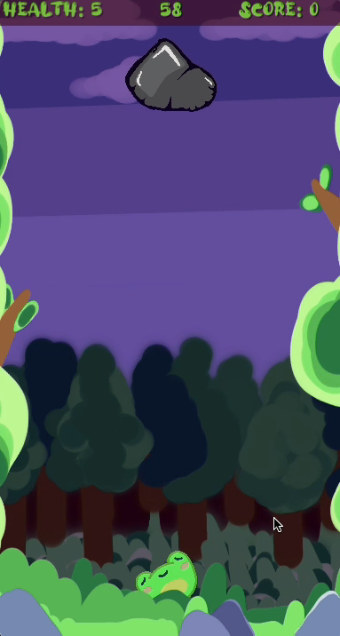

# **Read Me: JUMO !**
___

## **Overview**
___

It was like any other day in Loug Pond. The sun was shining, and all the frogs, froglets and tadpoles were having a grand ‘ol time. All except one. Usually GrandFroggy would be baking her famous creek cookies, but no one could smell the usual scent of her wonderful treats in the air. After the sudden realization, concern quickly followed in the mind of Loug Pond’s Denizens. After a while, GrandFroggy’s Neighbors finally knocked the door of her hut to no answer. Panicked, they quickly called her Grandson, Lumo. Lumo rushed over to find his GrandFroggy in bed, burning up with a fever! After calling the doctor, and hearing the diagnosis, “Flat Sedge”, Lumo knew that no ordinary medicine would hear his ailing GrandFrog.
After searching her cupboards high and low, Lumo finally found the old recipe tin in the back of the pantry that revealed the healing recipe for his GrandFroggy. The only thing was , he had to go all the way to swaog swamp to get the ingredients. He looked at his ailing GrandFroggy, her labored breathing barely making a sound. “If it means she gets better, then I have no other choice! “He thought. And with that thought, he set off to get the ingredients to save his GrandFroggy.

## **Gameplay Screenshot**
---

## **Controls**
---

* The player will use the mouse to click on either side of the screen to help Jumo navigate upwards.

* While doing so, the player has to try to collect as many flies as possible, before the 60 seconds runs out 

* The player has 5 lives, and has to avoid the decending rocks. when the player has no lives left, the game over event will be triggered.

## **Known Bugs**
---
* so, when I try to let the player replay or play again from the menu without exiting the application, all the scripts fail to work? so I am currently finding a fix for that .  

## **Tips**
---
* The rocks fall faster as time goes by, so keep that in mind while progressing. 
* If you fall, the player will lose as well. 

## **Troubleshooting**
---

* in the event of error or other issues, the player will just have to re-execute the application. 

## **Credits**
---
Hawa Sylla, _CMIS 1302: Programming for games II_
